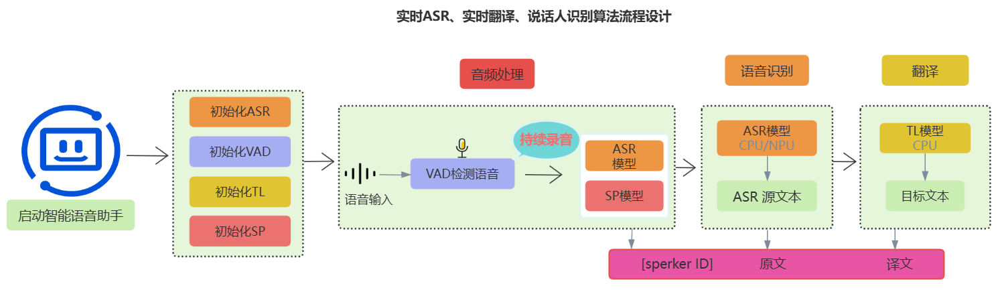

# LANGO - 实时 ASR + 翻译 + 说话人识别

<div align="center">



**基于 RK3576/MTKG520 的实时语音识别与翻译系统**

[](https://developer.android.com/)
[](https://kotlinlang.org/)
[](https://onnxruntime.ai/)
[](https://github.com/rockchip-linux/rknn-toolkit2)

</div>

## 📖 项目简介

LANGO 是一款高性能的 Android 实时语音处理应用，集成了自动语音识别（ASR）、机器翻译和说话人识别三大功能，专为 RK3576 和 MTKG520 等边缘 AI 芯片优化，支持 NPU 加速推理。

### ✨ 核心特性

- 🎤 **实时语音识别**：基于 SenseVoice/Whisper RKNN 模型，支持离线高精度识别
- 🌐 **实时翻译**：集成 Helsinki 翻译模型，支持中英互译
- 👥 **说话人识别**：基于 3D-Speaker 声纹识别技术，自动区分不同说话人
- ⚡ **NPU 硬件加速**：利用 RKNN Runtime 实现模型推理加速
- 🔄 **流式处理**：采用协程驱动的 Pipeline 架构，低延迟实时反馈
- 💾 **智能缓存**：翻译结果缓存 + 防抖机制，优化性能和用户体验

### 🎯 技术亮点

- **模块化架构**：清晰的 Model-Pipeline-UI 三层分离设计
- **协程并发**：VAD、ASR、说话人识别、翻译并行处理
- **JNI 集成**：Kotlin 封装 C/C++ 原生库，高效调用 ONNX Runtime
- **Jetpack Compose**：现代化 UI 框架，Material 3 设计语言
- **统一配置管理**：`ModelConfig.kt` 集中管理所有参数和特性开关

---

## 🚀 快速开始

### 环境要求

- **开发环境**
  - Android Studio Hedgehog (2023.1.1) 或更高版本
  - JDK 17
  - Android SDK 21+（目标 SDK 34）
  - Gradle 8.2.2

- **运行环境**
  - Android 5.0+ (API 21+)
  - ARM64-v8a 架构设备
  - 推荐：RK3576 或 MTKG520 芯片（支持 RKNN NPU）
  - 权限：录音、网络访问

### 安装步骤

#### 1️⃣ 克隆仓库

```bash
git clone https://github.com/YOUR_USERNAME/AI-real-time-ASR-Translate-SpeakerID.git
cd AI-real-time-ASR-Translate-SpeakerID
```

#### 2️⃣ 配置模型和资源文件

**⚠️ 重要：模型文件较大，未包含在 Git 仓库中。应用采用按需下载机制，首次启动时自动从服务器下载。**

详细的模型下载和配置说明请查看：[📦 MODEL_DOWNLOAD_GUIDE.md](./SherpaOnnxSimulateStreamingAsr/MODEL_DOWNLOAD_GUIDE.md)

##### 快速摘要：

**运行时模型存储路径（自动下载到设备）：**

```
/storage/emulated/0/Android/data/com.k2fsa.sherpa.onnx.simulate.streaming.asr/files/models/
├── ASR/
│   └── sense-voice-rknn/
│       ├── model-10-seconds.rknn    # ASR 模型（RKNN 格式，473MB）
│       └── tokens.txt               # 词表（308KB）
├── VAD/
│   └── silero_vad.onnx              # VAD 模型（629KB）
├── Speaker/
│   └── 3dspeaker_speech_campplus_sv_zh-cn_16k-common.onnx  # 说话人识别（27MB）
└── Translation/
    ├── zh-en/                        # 中→英翻译模型（237MB）
    └── en-zh/                        # 英→中翻译模型（237MB）
```

**配置模型服务器**（编辑 `ModelConfig.kt`）：

```kotlin
object Selection {
    var MODEL_SERVER_URL = "http://your-model-server.com/models"
}
```

**所需原生库文件（需手动放置）：**

```
SherpaOnnxSimulateStreamingAsr/app/src/main/jniLibs/arm64-v8a/
├── libsherpa-onnx-jni.so             # Sherpa-ONNX JNI 封装
├── libhelsinki-onnx-jni.so           # Helsinki 翻译 JNI
├── libonnxruntime.so                 # ONNX Runtime
├── librknnrt.so                      # RKNN Runtime
└── librga.so                         # RGA 图形库
```

#### 3️⃣ 构建项目

```bash
cd SherpaOnnxSimulateStreamingAsr
./gradlew assembleDebug
```

#### 4️⃣ 安装到设备

```bash
./gradlew installDebug
```

或在 Android Studio 中点击 Run 按钮。

---

## 🏗️ 架构设计

### 系统架构图

```
┌─────────────┐
│ HomeScreen  │ (Jetpack Compose UI)
└──────┬──────┘
       │ 控制录音 & 显示结果
       ↓
┌──────────────────────────────────────┐
│      SpeechPipeline                  │
│  (协程驱动的流式处理引擎)              │
│                                      │
│  AudioRecorder → VAD → ASR           │
│                    ↓                 │
│         [Speaker ID + Translation]   │
└──────────────┬───────────────────────┘
               │ 回调结果
               ↓
┌──────────────────────────────────────┐
│    SimulateStreamingAsr (单例)       │
│  ┌──────────────────────────────┐   │
│  │ - OfflineRecognizer (ASR)    │   │
│  │ - Vad (VAD)                  │   │
│  │ - SpeakerEmbeddingExtractor  │   │
│  │ - SpeakerEmbeddingManager    │   │
│  │ - HelsinkiONNXKV (翻译)      │   │
│  └──────────────────────────────┘   │
└──────────────────────────────────────┘
               ↓ JNI
┌──────────────────────────────────────┐
│   Native Libraries (C/C++)           │
│   - Sherpa-ONNX                      │
│   - ONNX Runtime                     │
│   - RKNN Runtime (NPU)               │
└──────────────────────────────────────┘
```

### 核心组件说明

| 组件 | 职责 | 文件路径 |
|------|------|----------|
| **SimulateStreamingAsr** | 全局模型生命周期管理（单例模式） | `simulate/streaming/asr/SimulateStreamingAsr.kt` |
| **SpeechPipeline** | 音频流处理协调器（VAD→ASR→SpeakerID→Translation） | `pipeline/SpeechPipeline.kt` |
| **AudioRecorder** | 音频采集封装（16kHz 单声道 PCM） | `pipeline/AudioRecorder.kt` |
| **ModelConfig** | 统一配置管理（模型选择、运行参数、特性开关） | `config/ModelConfig.kt` |
| **HomeScreen** | 主界面（录音控制、结果展示、复制功能） | `screens/Home.kt` |

### 数据流

```
用户按下录音按钮
    ↓
AudioRecorder 采集音频 (16kHz, 512 samples/窗口)
    ↓
SpeechPipeline.feedAudio(samples)
    ↓
[VAD 检测] → 识别语音边界
    ↓
[ASR 识别] → 每 400ms 输出中间结果 + VAD 结束输出最终结果
    ↓
并行处理：
├─ [说话人识别] → 提取声纹 → 匹配/注册说话人
└─ [翻译] → 缓存查询 → ONNX 推理 (防抖 500ms)
    ↓
回调更新 UI
├─ onIntermediateResult (实时显示)
├─ onFinalResult (确认文本)
└─ onTranslationUpdate (异步翻译)
```

---

## 🛠️ 开发指南

### 构建命令

```bash
# 调试构建
./gradlew assembleDebug

# 发布构建
./gradlew assembleRelease

# 清理构建
./gradlew clean

# 运行单元测试
./gradlew test

# 运行仪器化测试（需要连接设备）
./gradlew connectedAndroidTest

# 代码检查
./gradlew lint
```

### 修改模型配置

编辑 `app/src/main/java/com/k2fsa/sherpa/onnx/config/ModelConfig.kt`：

```kotlin
object ModelConfig {
    object Selection {
        var MODEL_SERVER_URL = "http://your-model-server.com/models"  // 模型下载服务器

        const val VAD_MODEL_TYPE = 0      // 0=Silero CPU, 1=TenVAD, 2=Silero RKNN
        const val ASR_MODEL_TYPE = 100    // 100=SenseVoice-RKNN, 101=Whisper-RKNN

        // 翻译模式：双向翻译（按ASR语言自动选方向）
        const val TRANSLATION_MODE = "BIDIRECTIONAL"  // 或 "UNIDIRECTIONAL"
        const val SOURCE_LANG1 = "en"    // 双向模式：方向1 源语言
        const val TARGET_LANG1 = "zh"    // 双向模式：方向1 目标语言
        const val SOURCE_LANG2 = "zh"    // 双向模式：方向2 源语言
        const val TARGET_LANG2 = "en"    // 双向模式：方向2 目标语言

        // 单向模式：const val TRANSLATION_MODEL_DIR = "helsinki-translation/ko-en"
    }

    object Pipeline {
        const val MAX_SPEAKERS = 15       // 最大说话人数量
        const val SPEAKER_THRESHOLD = 0.5f // 相似度阈值
        const val MIN_TRANSLATION_INTERVAL = 500L  // 翻译防抖间隔（毫秒）
    }

    object Features {
        const val ENABLE_TRANSLATION = true         // 启用翻译
        const val ENABLE_SPEAKER_ID = true          // 启用说话人识别
        const val ENABLE_REALTIME_TRANSLATION = true // 实时翻译（含中间结果）
    }
}
```

### 添加新模型

1. 在服务器上添加模型文件（按 `ASR/`, `VAD/`, `Speaker/`, `Translation/` 目录结构）
2. 在 `ModelDownloadManager.kt` 的 `getRequiredModels()` 中注册新模型的路径和大小
3. 创建 Kotlin 封装类（参考 `OfflineRecognizer.kt`）
4. 在 `ModelConfig.kt` 中添加配置
5. 在 `MainActivity.initializeAllModels()` 中初始化
6. 在 `SpeechPipeline.kt` 中集成处理逻辑

详见：[MODEL_DOWNLOAD_GUIDE.md - 添加新模型](./SherpaOnnxSimulateStreamingAsr/MODEL_DOWNLOAD_GUIDE.md#添加新模型)

### 性能调优

**调整线程数**（`ModelConfig.Runtime`）：
```kotlin
const val ASR_NUM_THREADS = 1          // ASR 推理线程
const val SPEAKER_NUM_THREADS = 1      // 说话人识别线程
```

**调整处理间隔**（`ModelConfig.Pipeline`）：
```kotlin
const val ASR_INTERMEDIATE_INTERVAL = 400L     // ASR 中间结果更新间隔
const val MIN_TRANSLATION_INTERVAL = 500L      // 翻译防抖间隔
```

---

## 📂 项目结构

```
AI-real-time-ASR-Translate-SpeakerID/
├── SherpaOnnxSimulateStreamingAsr/           # 主项目目录
│   ├── app/
│   │   ├── src/main/
│   │   │   ├── java/com/k2fsa/sherpa/onnx/
│   │   │   │   ├── simulate/streaming/asr/
│   │   │   │   │   ├── MainActivity.kt      # 应用入口
│   │   │   │   │   ├── SimulateStreamingAsr.kt  # 模型管理单例
│   │   │   │   │   └── screens/
│   │   │   │   │       ├── Home.kt          # 主界面
│   │   │   │   │       └── Help.kt          # 帮助页面
│   │   │   │   ├── pipeline/
│   │   │   │   │   ├── SpeechPipeline.kt   # 核心处理引擎
│   │   │   │   │   └── AudioRecorder.kt    # 音频采集
│   │   │   │   ├── config/
│   │   │   │   │   └── ModelConfig.kt      # 统一配置
│   │   │   │   └── [模型封装类]
│   │   │   │       ├── OfflineRecognizer.kt
│   │   │   │       ├── Vad.kt
│   │   │   │       ├── SpeakerEmbeddingExtractor.kt
│   │   │   │       ├── SpeakerEmbeddingManager.kt
│   │   │   │       └── Helsinki.kt
│   │   │   ├── assets/                      # 无模型文件（运行时自动下载）
│   │   │   └── jniLibs/arm64-v8a/          # 原生库（需手动放置）
│   │   │       └── [*.so]                  # 见安装步骤2
│   │   └── build.gradle.kts                # 应用级构建配置
│   ├── build.gradle.kts                    # 项目级构建配置
│   ├── gradle.properties                   # Gradle 配置
│   └── MODEL_DOWNLOAD_GUIDE.md             # 模型下载配置指南
├── picture/
│   └── 算法架构设计.png                     # 架构图
├── CLAUDE.md                               # Claude Code 开发指南
└── README.md                               # 本文件
```

---

## 🔧 技术栈

| 类别 | 技术 | 版本 |
|------|------|------|
| **语言** | Kotlin | 1.9.0 |
| **UI 框架** | Jetpack Compose | BOM 2023.08.00 |
| **并发** | Kotlin Coroutines | 内置 |
| **构建工具** | Gradle (Kotlin DSL) | 8.2.2 |
| **AI 推理** | ONNX Runtime | 1.x |
| **NPU 加速** | RKNN Runtime | RK3576 专用 |
| **JNI** | Sherpa-ONNX, Helsinki | 自定义封装 |
| **模型** | SenseVoice, Whisper, 3D-Speaker, Helsinki | ONNX/RKNN 格式 |

---

## 📄 许可证

本项目采用 **MIT License** 开源许可证，详见 [LICENSE](./LICENSE) 文件。

---

## 🤝 贡献

欢迎提交 Issue 和 Pull Request！

**开发前请阅读：**
- [CLAUDE.md](./CLAUDE.md) - 代码库架构和开发指南
- [MODEL_DOWNLOAD_GUIDE.md](./SherpaOnnxSimulateStreamingAsr/MODEL_DOWNLOAD_GUIDE.md) - 模型下载配置说明

---

## 📞 联系方式

如有问题或建议，请通过以下方式联系：

- 提交 [GitHub Issue](https://github.com/YOUR_USERNAME/AI-real-time-ASR-Translate-SpeakerID/issues)
- 邮件：your-email@example.com

---

## 🙏 致谢

- [Sherpa-ONNX](https://github.com/k2-fsa/sherpa-onnx) - 跨平台语音识别工具包
- [ONNX Runtime](https://onnxruntime.ai/) - 高性能 AI 推理引擎
- [RKNN Toolkit](https://github.com/rockchip-linux/rknn-toolkit2) - Rockchip NPU 开发工具
- [3D-Speaker](https://github.com/alibaba-damo-academy/3D-Speaker) - 阿里达摩院声纹识别
- [Helsinki-NLP](https://huggingface.co/Helsinki-NLP) - 开源翻译模型

---

<div align="center">

**⭐ 如果这个项目对你有帮助，请给个 Star！**

Made with ❤️ by [Your Name]

</div>
